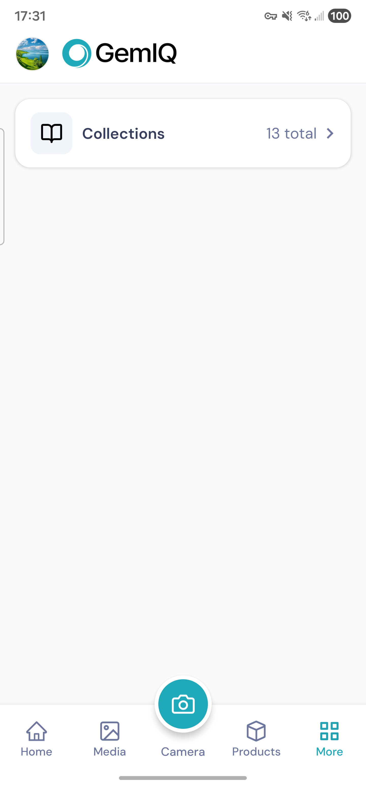
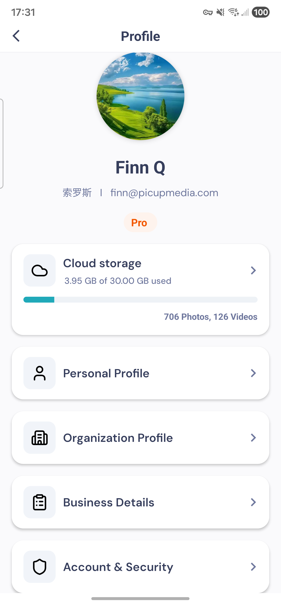
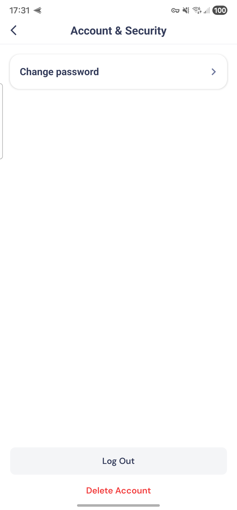

# Delete Your GemIQ Account

This page explains how to delete your `GemIQ(formerly GemHub)` account and request deletion of associated personal data.

## Delete Your Account in the App

If you can access the app, follow these steps:

1. Open the app and tap **More**.
2. Tap your profile photo in the top-left corner.
3. Tap **Account & Security**.
4. Scroll to the bottom and tap **Delete Account**.
5. Follow the on-screen instructions to confirm.

### Step 1
Open the app, go to **More**, and tap your profile photo in the top-left corner.

### Step 2
Tap **Account & Security**.

### Step 3
Scroll to the bottom and tap **Delete Account**.

## If You Cannot Access the App

If you cannot log in or access the app, you can request account deletion and user data deletion by contacting the developer:

- Developer: `Finn`
- Email: `finn@picupmedia.com`

## Data That Will Be Deleted

When your account is deleted, we will delete or anonymize the following data from our active systems, where applicable:

- Account profile information
- Login information
- User-generated content
- App preferences and settings
- Associated user records

## Privacy Policy

Privacy Policy: [https://picupmedia.com/privacy-policy](https://picupmedia.com/privacy-policy)

## Contact Us

If you have any questions about account or data deletion, please contact:

- Support email: [support@picupmedia.com](support@picupmedia.com)
- Phone number: +61430171380
- Website: [https://picupmedia.com/](https://picupmedia.com/)
